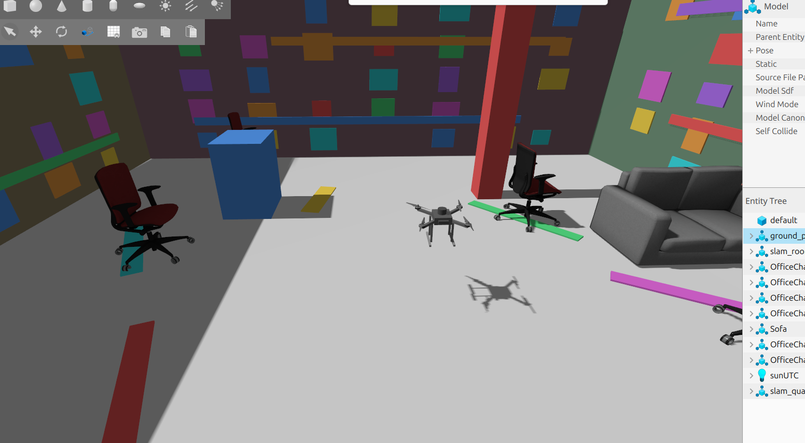

# ROS 2 + PX4 Autonomous GPS-Denied Drone

A ROS 2 Jazzy and PX4-based autonomous quadcopter platform developed for GPS-denied localization, mapping, navigation, and indoor exploration.

The project uses a custom quadcopter model in Gazebo Harmonic, PX4 SITL for flight control, ROS 2 for autonomy and middleware, and Point-LIO for LiDAR-inertial localization.

## Current Status

Milestones M0-M7 are complete.

The current system supports:

- PX4 SITL flight in Gazebo Harmonic
- ROS 2 ↔ PX4 communication through Micro XRCE-DDS
- Custom ROS 2 Offboard flight control
- Custom `slam_quad` Gazebo/PX4 vehicle model
- 3D LiDAR, RGB-D camera, and IMU integration
- ROS 2 TF sensor-frame integration
- Point-LIO LiDAR-inertial localization
- Point-LIO odometry conversion for PX4 external vision
- PX4 external-vision fusion
- GPS-denied position hold
- GPS-denied autonomous waypoint navigation
- Autonomous landing and disarming

## Latest Demonstration



The drone successfully completed a GPS-denied autonomous mission using Point-LIO localization and PX4 external-vision fusion.

Mission sequence:

1. Wait for stable localization
2. Enter PX4 Offboard mode
3. Arm
4. Take off approximately 0.85 m
5. Fly approximately 1.0 m to a waypoint
6. Hold position
7. Return to the starting position
8. Hold position
9. Land
10. Automatically disarm

GPS was disabled during the mission.
## System Architecture

```text
Gazebo Harmonic
      |
      | 3D LiDAR + IMU + Camera
      v
    ROS 2
      |
      +------> Point-LIO
      |           |
      |           v
      |      LiDAR-Inertial
      |        Odometry
      |           |
      |           v
      |      slam_to_px4
      |           |
      |           v
      +------> PX4 External Vision
                  |
                  v
              PX4 EKF2
                  |
                  v
           Offboard Controller
                  |
                  v
             slam_quad


```

## Coordinate Conversion

Point-LIO publishes odometry using the ROS ENU coordinate convention, while PX4 uses NED.

The position conversion used by the project is:

```text
PX4 X = ROS Y
PX4 Y = ROS X
PX4 Z = -ROS Z
```

## Software Stack

- Ubuntu Linux
- ROS 2 Jazzy
- PX4 Autopilot SITL
- Gazebo Harmonic
- Micro XRCE-DDS Agent
- Point-LIO
- Python
- C++
- QGroundControl

## Repository Structure

```text
ros2-px4-autonomous-drone/
├── ros2_ws/
│   └── src/
│       ├── drone_offboard_control/
│       └── slam_quad_description/
│
├── px4/
│   └── slam_quad/
│       ├── airframe/
│       └── models/
│
├── point_lio/
│   ├── config/
│   └── launch/
│
├── gazebo/
│   └── worlds/
│
├── docs/
├── images/
└── scripts/
```

## Custom ROS 2 Nodes

The `drone_offboard_control` package currently contains:

- `offboard_control` — basic autonomous PX4 Offboard mission
- `mapping_mission` — autonomous flight mission for mapping tests
- `slam_to_px4` — converts SLAM odometry for PX4 external-vision fusion
- `lidar_time_converter` — converts LiDAR timestamps for Point-LIO compatibility
- `gps_denied_waypoint` — GPS-denied autonomous waypoint controller


## Project Milestones

- **M0** — PX4 SITL + Gazebo flight
- **M1** — ROS 2 ↔ PX4 communication
- **M2** — Autonomous Offboard control
- **M3** — Custom `slam_quad` vehicle
- **M4** — Sensor and TF integration
- **M5-M6** — Localization preparation and integration
- **M7** — GPS-denied localization and autonomous navigation
- **M8** — 3D occupancy mapping
- **M9** — 3D path planning
- **M10** — Obstacle avoidance
- **M11** — Autonomous waypoint navigation
- **M12** — Frontier exploration
- **M13** — Full autonomous exploration
- **M14** — Optional semantic mapping

## Third-Party Components

This repository contains project-specific configuration and integration work for several open-source projects.

External dependencies include:

- PX4 Autopilot
- ROS 2
- Gazebo
- Micro XRCE-DDS
- Point-LIO

Original third-party model assets retain their respective licenses and attribution. The `slam_quad` model directory includes the original BSD 3-Clause license associated with the upstream model assets.

## Development Status

This repository currently documents the project through **M7: GPS-denied autonomous waypoint navigation**.

Development continues with M8 and later milestones.

