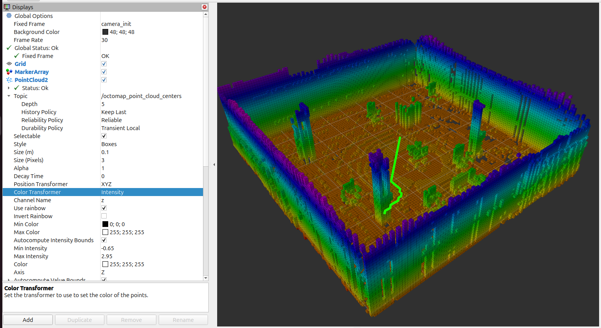
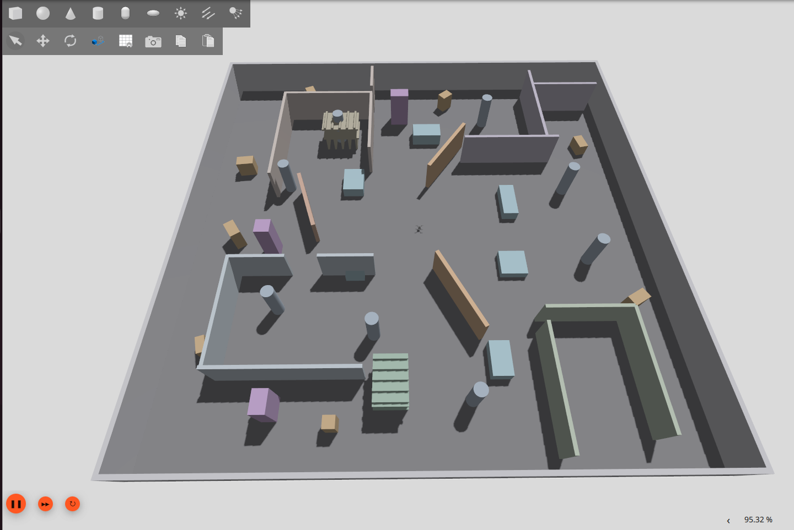

# ROS 2 + PX4 Autonomous GPS-Denied Drone

A ROS 2 Jazzy and PX4-based autonomous quadcopter platform developed for GPS-denied localization, mapping, navigation, and indoor exploration.

The project uses a custom quadcopter model in Gazebo Harmonic, PX4 SITL for flight control, ROS 2 for autonomy and middleware, and Point-LIO for LiDAR-inertial localization.

## Current Status

**Milestones M0–M9 complete. M10 in progress.**

The current system supports:

- PX4 SITL flight in Gazebo Harmonic
- ROS 2 and PX4 communication through Micro XRCE-DDS
- Custom ROS 2 Offboard flight control
- Custom `slam_quad` Gazebo/PX4 vehicle model
- 3D LiDAR, RGB-D camera, and IMU integration
- ROS 2 TF sensor-frame integration
- Point-LIO LiDAR-inertial localization
- Point-LIO odometry conversion for PX4 external vision
- PX4 external-vision fusion
- GPS-denied position hold
- GPS-denied autonomous waypoint navigation
- Autonomous landing and disarming
- OctoMap-based 3D occupancy mapping
- Persistent `.bt` map saving and reloading
- Custom offline 3D A* path planning
- 3D occupancy and obstacle-clearance validation

Current M10 development focuses on Point-LIO localization
robustness, ground-truth comparison, and preparation for
integrated autonomous obstacle avoidance.

## Original Engineering Contributions

**Project developer: Ammaar Ahmed**

This project includes original implementation, customization,
and system integration work.

| Component | Contribution |
|---|---|
| C++ 3D A* planner | Custom ROS 2 implementation, obstacle-clearance constraints, and path validation |
| OctoMap query node | Custom occupancy-map querying utility |
| URDF/Xacro | Project-specific drone sensor frames and TF integration |
| Gazebo environments | Custom environments for mapping, localization, and navigation experiments |
| slam_quad | Vehicle customization, sensor integration, and PX4/Gazebo configuration |
| ROS 2 autonomy | Project-specific flight-control, localization-integration, and mission functionality |
The project incorporates third-party open-source software
and existing model assets. Original upstream copyrights
and licenses are preserved.

**[Detailed authorship and acknowledgments](AUTHORS.md)**

## Latest Demonstration

### M9 — 3D A* Path Planning



Milestone 9 implemented a custom C++ 3D A* planner using
the saved M8 OctoMap.

The planner performs three-dimensional occupancy checks,
applies horizontal and vertical obstacle-clearance
constraints, and publishes the resulting path to RViz.

**Validated planning results:**

| Test | Result |
|---|---:|
| Standard A* planning | PASS |
| Expanded nodes | 9,250 |
| Path nodes | 38 |
| Standard path distance | 4.65 m |
| Standard path altitude | 1.05 m |
| Altitude-changing 3D test | PASS |
| 3D test path distance | 4.91 m |
| 3D test altitude range | 0.85–1.65 m |
| Final path validation | PASS |
The planner uses 0.30 m horizontal clearance and
0.20 m vertical clearance.

**[View M9 documentation](docs/M09_3D_ASTAR_PLANNING.md)**

### M10 — Localization Robustness Testing



M10 is currently evaluating Point-LIO localization in
a larger Gazebo environment containing varied geometric
structures and obstacles.

The first testing stage includes:

- Development of a larger geometrically rich environment
- LiDAR preprocessing investigation
- Filtering of non-finite simulated LiDAR measurements
- Localization testing at approximately 1.8 m altitude
- Comparison of Point-LIO estimates with Gazebo ground truth

Initial testing indicated improved tracking behavior in
the new environment. Exact numerical tracking-error
results will be documented separately.

**[View M10 testing documentation](docs/M10_LOCALIZATION_TESTING.md)**

Previous milestone:

**[M8 — OctoMap 3D Occupancy Mapping](docs/M08_OCTOMAP_3D_MAPPING.md)**

M9 demonstrates offline planning using a frozen map.
Integrated online replanning and autonomous obstacle
avoidance remain future development objectives.

## System Architecture

The project currently contains a GPS-denied flight
control pipeline and a separate mapping and planning
pipeline.

**GPS-denied flight control:**

    Gazebo: LiDAR + IMU
              |
              v
             ROS 2
              |
              v
           Point-LIO
              |
              v
         slam_to_px4
              |
              v
       PX4 External Vision
              |
              v
           PX4 EKF2
              |
              v
      Offboard Controller
              |
              v
           slam_quad
**3D mapping and offline planning:**

    Point-LIO
        |
        v
    Body-frame Point Cloud
        |
        v
    OctoMap Server
        |
        v
    3D Occupancy Map
        |
        v
    Saved M8 OctoMap
        |
        v
    Custom 3D A*
        |
        v
    Clearance and Path Validation
        |
        v
    /planned_path
        |
        v
       RViz
The second pipeline currently demonstrates offline
path planning and visualization. Connecting the
planned routes to autonomous flight execution is
a subsequent development stage.

## Coordinate Conversion

Point-LIO publishes odometry using the ROS ENU coordinate convention, while PX4 uses NED.

The position conversion used by the project is:

```text
PX4 X = ROS Y
PX4 Y = ROS X
PX4 Z = -ROS Z
```

## Software Stack

- Ubuntu Linux
- ROS 2 Jazzy
- PX4 Autopilot SITL
- Gazebo Harmonic
- Micro XRCE-DDS Agent
- Point-LIO
- OctoMap / octomap_server
- Custom C++ 3D A* planner
- RViz
- Python
- C++
- QGroundControl

## Repository Structure

```text
ros2-px4-autonomous-drone/
|-- ros2_ws/
|   `-- src/
|       |-- drone_offboard_control/
|       |-- slam_quad_description/
|       `-- drone_3d_planner/
|
|-- px4/
|   `-- slam_quad/
|       |-- airframe/
|       `-- models/
|
|-- point_lio/
|   |-- config/
|   |   |-- velody16.yaml
|   |   `-- velody16_m10.yaml
|   |-- launch/
|   `-- patches/
|       `-- m10_filter_nonfinite_lidar.patch
|
|-- gazebo/
|   `-- worlds/
|       `-- m10_large_world.sdf
|
|-- octomap/
|   `-- maps/
|       `-- slam_room_office_m8.bt
|
|-- docs/
|   |-- M08_OCTOMAP_3D_MAPPING.md
|   |-- M09_3D_ASTAR_PLANNING.md
|   `-- M10_LOCALIZATION_TESTING.md
|
|-- images/
|   |-- octomap/
|   |-- m9_planning/
|   `-- m10_testing/
|
`-- scripts/
```

The repository contains project-specific ROS 2 packages, simulation environments, configuration files, validation results, and documentation.

## Custom ROS 2 Nodes

The `drone_offboard_control` package currently contains:

- `offboard_control` — basic autonomous PX4 Offboard mission
- `mapping_mission` — autonomous flight mission for mapping tests
- `slam_to_px4` — converts SLAM odometry for PX4 external-vision fusion
- `lidar_time_converter` — converts LiDAR timestamps for Point-LIO compatibility
- `gps_denied_waypoint` — GPS-denied autonomous waypoint controller

The separate `drone_3d_planner` package contains:

- `astar_3d` — custom three-dimensional A* path planner
- `octomap_query` — interactive OctoMap occupancy-query utility

## Project Milestones

- **M0** — PX4 SITL + Gazebo flight: complete
- **M1** — ROS 2 and PX4 communication: complete
- **M2** — Autonomous Offboard control: complete
- **M3** — Custom `slam_quad` vehicle: complete
- **M4** — Sensor and TF integration: complete
- **M5–M6** — Localization preparation and integration: complete
- **M7** — GPS-denied localization and autonomous navigation: complete
- **M8** — [3D occupancy mapping](docs/M08_OCTOMAP_3D_MAPPING.md): complete
- **M9** — [3D A* path planning](docs/M09_3D_ASTAR_PLANNING.md): complete
- **M10** — [Localization robustness testing and obstacle-avoidance development](docs/M10_LOCALIZATION_TESTING.md): in progress
- **M11** — Autonomous waypoint integration with planned routes: planned
- **M12** — Frontier exploration: planned
- **M13** — Full autonomous exploration: planned
- **M14** — Optional semantic mapping: planned

## Third-Party Components

This repository contains project-specific configuration and integration work for several open-source projects.

External dependencies include:

- PX4 Autopilot
- ROS 2
- Gazebo
- Micro XRCE-DDS
- Point-LIO
- OctoMap

Original third-party model assets retain their respective licenses and attribution. The `slam_quad` model directory includes the original BSD 3-Clause license associated with the upstream model assets.

## Development Status

**M0–M9 are complete. M10 is in progress.**

The project currently demonstrates GPS-denied autonomous
flight, LiDAR-inertial localization, 3D occupancy mapping,
and validated offline 3D A* path planning.
The current development stage focuses on localization
robustness in larger environments and preparation for
integrating the planner with autonomous flight and
obstacle avoidance.

See the individual milestone documents for technical
details, implementation, testing procedures, and results.

