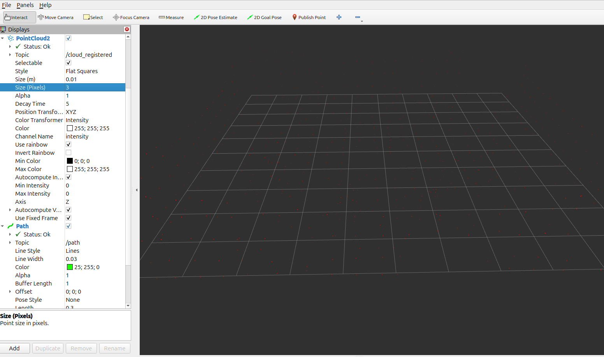

# M4 — Sensor and TF Integration

## Goal

Integrate the sensors and ROS 2 coordinate frames required for later SLAM, localization, and autonomous navigation.

## Main Components

- Custom `slam_quad` model
- 3D LiDAR
- RGB-D camera
- IMU
- ROS 2
- Gazebo Harmonic
- `robot_state_publisher`
- Custom `slam_quad_description` package

## Implementation

The custom quadcopter was extended with simulated perception sensors and corresponding ROS 2 frame definitions.

The `slam_quad_description` package was created to define the sensor transforms used by the autonomy stack.

Important frame relationships included:

- `base_link` → `lidar_link`
- `base_link` → `camera_link`
- `camera_link` → `camera_optical_frame`

The LiDAR point cloud was configured to use `lidar_link` as its frame.

The RGB-D camera optical frame was also corrected so that downstream ROS 2 perception tools received data using the expected camera coordinate convention.

Gazebo sensor data was bridged into ROS 2, and the complete TF tree was inspected in RViz.

## Validation

### TF and Sensor Validation

The following were verified:

1. LiDAR data was available in ROS 2.
2. RGB-D camera data was available in ROS 2.
3. IMU data was available.
4. Sensor frame IDs were correct.
5. The TF tree was connected correctly.
6. RViz displayed the sensor frames without TF errors.

### Full-Stack Hover Test

PX4/Gazebo, the Micro XRCE-DDS Agent, sensor bridges, and `robot_state_publisher` were run together.

The custom `slam_quad`:

1. Passed PX4 preflight checks.
2. Took off manually.
3. Hovered stably for approximately 30-60 seconds.
4. Landed successfully.

### Autonomous Mission Test

With the full sensor and TF stack active, the custom Offboard controller successfully executed:

1. Offboard-mode request.
2. Arming.
3. Takeoff to approximately 2 m.
4. Position hold.
5. Flight approximately 2 m in the X direction.
6. Position hold.
7. Return to origin.
8. Final hold.
9. Automatic landing.
## Result

**PASSED**

M4 established the complete sensor and coordinate-frame infrastructure required for the later LiDAR-inertial localization and GPS-denied flight milestones.
