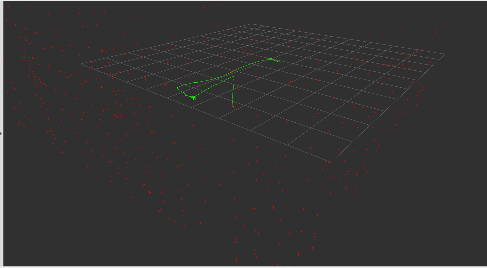
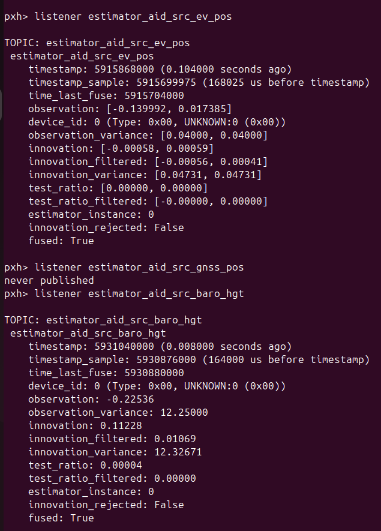
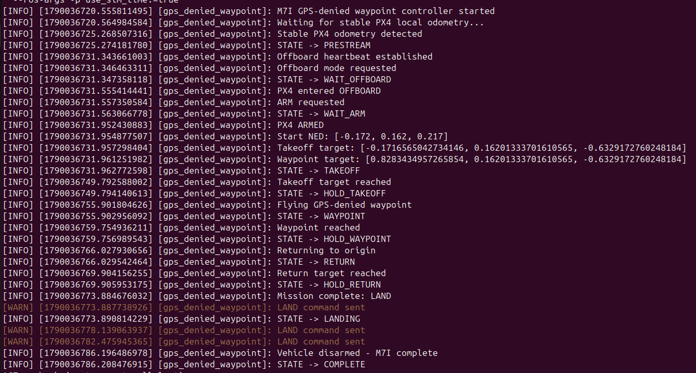

# M7 — GPS-Denied Localization and Autonomous Navigation

## Goal

Develop and validate a complete GPS-denied localization and autonomous flight pipeline using Point-LIO odometry and PX4 external-vision fusion.

## System Pipeline

The final M7 localization and control pipeline was:

Point-LIO → ROS 2 odometry → `slam_to_px4` → PX4 External Vision → EKF2 → Offboard controller

This allowed the drone to estimate and control its position without GPS.

## M7A — Point-LIO Setup

Point-LIO was integrated into the ROS 2 Jazzy workspace and configured for the simulated 3D LiDAR and IMU.

The configuration was adapted to match the drone sensor layout and simulation environment.

Important setup work included:

- ROS 2 simulation time support
- LiDAR topic configuration
- IMU topic configuration
- LiDAR-to-IMU extrinsic configuration
- Point-cloud preprocessing configuration
- Point-LIO launch integration

## M7B — LiDAR Preprocessing and Timing

The simulated LiDAR output required preprocessing before Point-LIO could use it reliably.

A custom ROS 2 node named `lidar_time_converter` was used to correct timestamp compatibility.

Sensor timing, message flow, and Point-LIO input handling were tested until the estimator could process the simulated LiDAR and IMU data continuously.

## M7C — Localization Output Validation

Point-LIO output was monitored while the drone moved in simulation.
Validation focused on:

1. Continuous odometry output.
2. Correct motion direction.
3. Stable altitude estimation.
4. Reasonable X/Y position tracking.
5. Consistent orientation behavior.
6. No immediate estimator divergence under normal motion.

Point-LIO successfully produced LiDAR-inertial odometry suitable for later PX4 external-vision integration.

## M7D — Localization Tuning

Point-LIO was tuned for the simulated LiDAR geometry and indoor environment.

Important tuning work included:

- Matching the estimator to the simulated LiDAR beam count
- Using a 32-beam vertical configuration
- Using approximately ±15° vertical field of view
- Using 640 horizontal samples
- Using a 4 ms per-scan timing configuration
- Confirming IMU usage
- Confirming the LiDAR-to-IMU extrinsic translation
- Testing gravity and simulation-time behavior

The final working sensor baseline was kept consistent during later experiments so that changes in localization quality could be isolated.

## M7E — Localization Robustness Testing

The estimator was tested under different indoor geometry conditions.

Weak or repetitive geometry could produce poor constraints in X/Y and cause large localization corrections.

This led to two planned improvement directions:

1. Estimator-side degeneracy detection and adaptive weighting inside Point-LIO.
2. A richer Gazebo world containing stronger 3D structure such as tall pillars, shelves, partial walls, side structures, corners, edges, and nonparallel vertical surfaces.

These approaches were identified for future testing while preserving the current validated baseline.

## M7F — Point-LIO to PX4 External Vision

A custom ROS 2 node named `slam_to_px4` was developed to convert Point-LIO odometry into the coordinate convention required by PX4 external-vision fusion.

ROS uses ENU coordinates, while PX4 uses NED coordinates.

The position conversion used was:

- PX4 X = ROS Y
- PX4 Y = ROS X
- PX4 Z = -ROS Z

The converted pose and motion estimate were then provided to PX4 for EKF2 external-vision fusion.

This created the link between the ROS 2 localization stack and the PX4 flight controller.

## M7G — GPS + External-Vision Fusion

PX4 EKF2 was configured to accept the converted Point-LIO estimate as an external-vision source.

The initial fusion stage was tested with normal simulation support still available so that the external-vision pipeline could be verified safely before removing GPS.

Validation focused on:

1. External-vision messages reaching PX4.
2. EKF2 accepting the vision estimate.
3. Position estimates remaining stable.
4. No immediate estimator rejection or large frame mismatch.
5. PX4 maintaining normal flight-control behavior while vision data was fused.

This stage confirmed that Point-LIO data could be used by PX4 as a valid external localization source.

## M7H — GPS-Denied Hover

After external-vision fusion was validated, GPS was disabled and the drone was tested using Point-LIO-based localization.

The drone successfully:

1. Passed preflight checks.
2. Entered the required flight mode.
3. Armed.
4. Took off.
5. Maintained a stable hover using external-vision localization.
6. Landed successfully.

This demonstrated that the drone could maintain controlled flight without GPS.

## M7I — GPS-Denied Autonomous Waypoint Mission

A dedicated ROS 2 controller named `gps_denied_waypoint` was developed for the final M7 validation.

The controller waited for stable odometry before starting the mission.

The autonomous sequence was:

1. Detect stable localization.
2. Prestream Offboard setpoints.
3. Enter PX4 Offboard mode.
4. Arm.
5. Perform a relative takeoff of approximately 0.85 m.
6. Fly approximately 1.0 m to a waypoint.
7. Hold position.
8. Return to the original position.
9. Hold again.
10. Command LAND.
11. Automatically disarm after landing.

The complete mission was successfully executed with GPS disabled.

## Final M7 Result

**PASSED**

M7 demonstrated a complete GPS-denied autonomy pipeline:

Point-LIO localization → ROS 2 coordinate conversion → PX4 external-vision fusion → Offboard control → autonomous waypoint flight.

The final system was able to take off, navigate to a waypoint, return, land, and disarm without relying on GPS.
