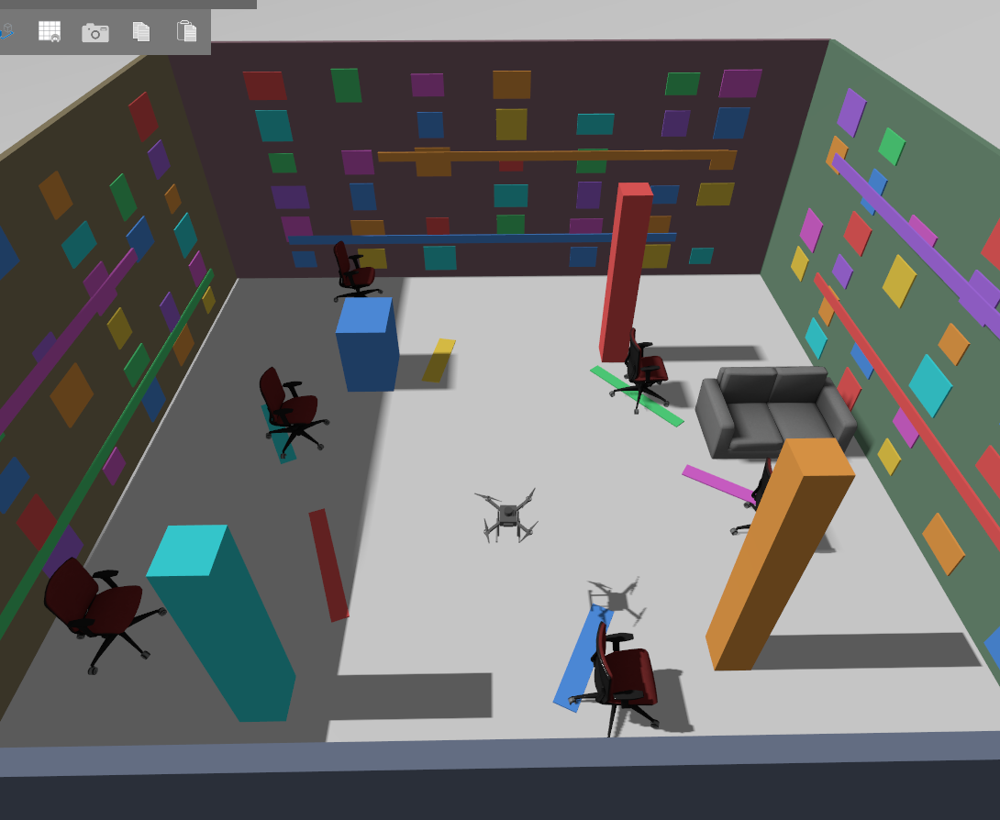
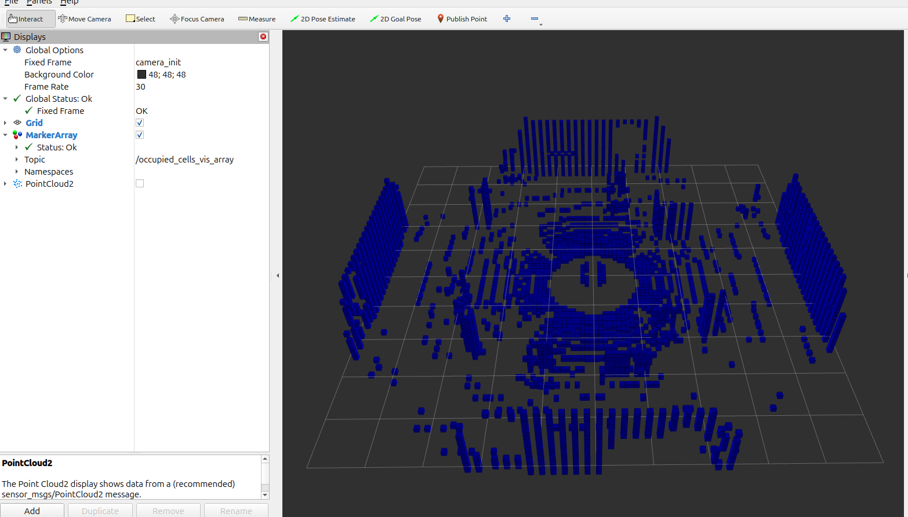
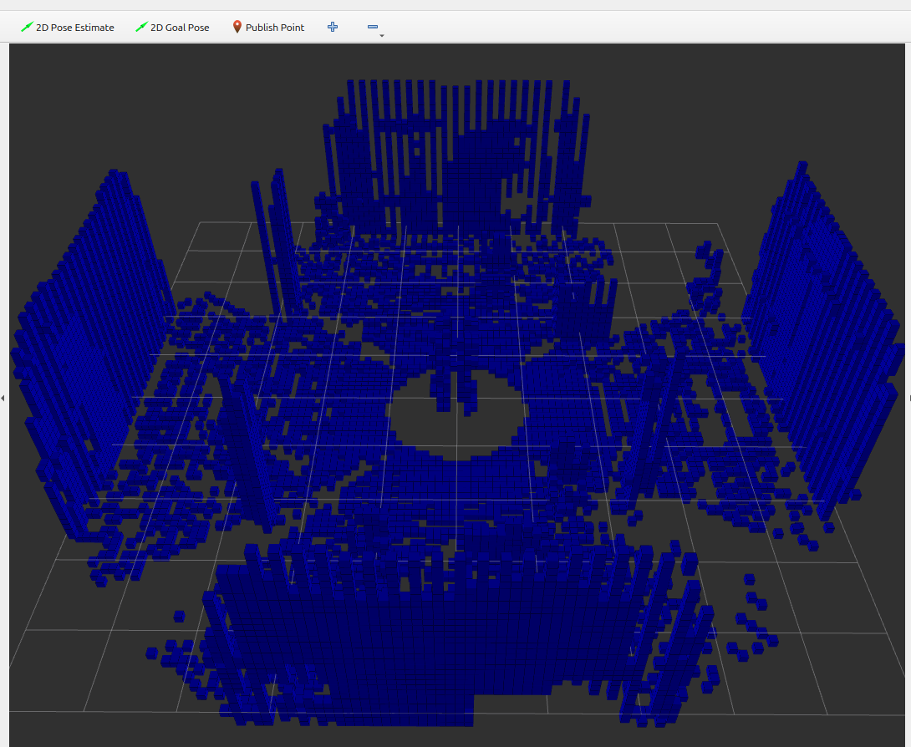
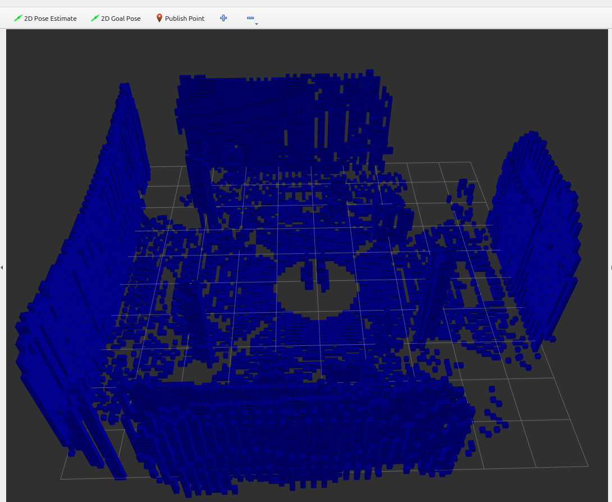
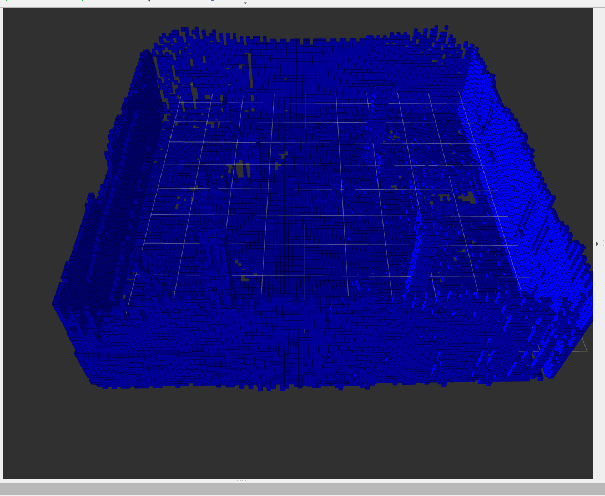
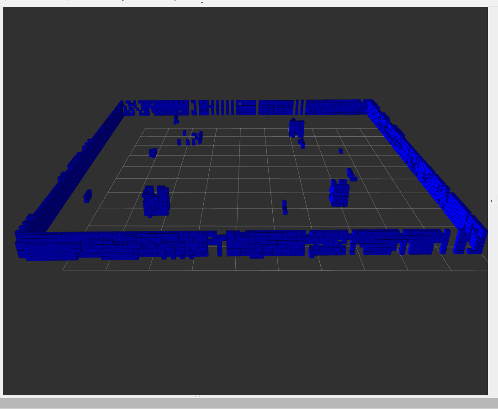

# M8 — OctoMap 3D Occupancy Mapping

## Objective

Milestone 8 added 3D occupancy mapping to the ROS 2 + PX4 drone stack using OctoMap.

The goal was to convert Point-LIO output into a persistent 3D voxel representation of the environment while preserving occupied structures and open navigable space.

## Mapping Pipeline

The validated M8 pipeline was:

    Point-LIO
    /cloud_registered_body
            +
    camera_init → body TF
            ↓
    OctoMap Server
            ↓
    3D Occupancy Map

The corrected Point-LIO input used for the final OctoMap pipeline was:

    /cloud_registered_body

`/cloud_registered` was not used for the final validated M8 configuration.

The OctoMap reference frame was:

    camera_init

## Environment
M8 was validated in the custom Gazebo SLAM room containing walls, pillars, furniture, vertical structures, and obstacles at multiple heights.

## Live OctoMap

A fresh live OctoMap was started with:

    source /opt/ros/jazzy/setup.bash
    source ~/drone_ws/install/setup.bash

    ros2 run octomap_server octomap_server_node \
      --ros-args \
      -p use_sim_time:=true \
      -p resolution:=0.10 \
      -p frame_id:=camera_init \
      -p sensor_model.max_range:=5.5 \
      -r cloud_in:=/cloud_registered_body

The validated settings included:

- Voxel resolution: `0.10 m`
- Maximum sensor range: `5.5 m`
- Reference frame: `camera_init`
- Point-cloud input: `/cloud_registered_body
### Live Mapping Progression

The following images show the OctoMap growing as additional Point-LIO measurements were integrated.

The progression shows room boundaries and internal structures gradually becoming represented as occupied voxels.

## RViz Visualization

RViz was started with simulation time enabled:

    source /opt/ros/jazzy/setup.bash
    source ~/drone_ws/install/setup.bash

    rviz2 --ros-args -p use_sim_time:=true

The primary RViz configuration was:

    Fixed Frame:
    camera_init

    MarkerArray:
    /occupied_cells_vis_array
Optional displays included:

    PointCloud2:
    /octomap_point_cloud_centers

    PointCloud2:
    /cloud_registered_body

For `/octomap_point_cloud_centers`:

    Style = Boxes
    Size = 0.10 m

## Completed 3D Occupancy Map

The completed OctoMap reproduced the room boundaries and major internal structures in three dimensions.

## Free-Space Validation

An important M8 validation step was confirming that OctoMap represented occupied surfaces without filling the entire environment with occupied voxels.

The resulting map preserved the open interior of the room while representing walls and internal obstacles as occupied cells.

This demonstrated that the Point-LIO-to-OctoMap pipeline produced a useful 3D occupancy representation rather than simply accumulating a dense point cloud.

## Saving the Map

The live OctoMap was saved using:

    source /opt/ros/jazzy/setup.bash
    source ~/drone_ws/install/setup.bash

    mkdir -p ~/drone_ws/maps

    ros2 run octomap_server octomap_saver_node \
      --ros-args \
      -p octomap_path:=$HOME/drone_ws/maps/slam_room_office_m8.bt

The validated saved map was:

    ~/drone_ws/maps/slam_room_office_m8.bt

A copy is included in this repository at:

    octomap/maps/slam_room_office_m8.bt

## Reloading the Saved Map

The saved OctoMap can be loaded instead of creating a new map from live LiDAR data.

RViz should already be running before starting the reloaded OctoMap server because its visualization may be published immediately.

    source /opt/ros/jazzy/setup.bash
    source ~/drone_ws/install/setup.bash

    ros2 run octomap_server octomap_server_node \
      --ros-args \
      -p use_sim_time:=true \
      -p frame_id:=camera_init \
      -p octomap_path:=$HOME/drone_ws/maps/slam_room_office_m8.bt \
      -p full:=true \
      -p resolution:=0.10 \
      -p latch:=true \
      -r cloud_in:=/m8_reload_no_cloud

The fake cloud remap:

    /m8_reload_no_cloud

prevents new live LiDAR measurements from modifying the loaded map.

## Optional Flight-Height Slice
For inspection of occupancy around approximately 1 m altitude:

    ros2 param set /octomap_server occupancy_min_z 0.75
    ros2 param set /octomap_server occupancy_max_z 1.25

To return to the complete vertical map:

    ros2 param set /octomap_server occupancy_min_z -10.0
    ros2 param set /octomap_server occupancy_max_z 10.0

## Validation Result

M8 passed.

The validated system demonstrated:

- Live 3D occupancy-map generation from Point-LIO.
- Correct use of `/cloud_registered_body`.
- Mapping in the `camera_init` reference frame.
- `0.10 m` voxel resolution.
- Reconstruction of room walls and internal obstacles.
- Preservation of open interior space.
- Saving the generated OctoMap as a `.bt` file.
- Reloading the saved map without allowing new LiDAR scans to modify it.

M8 therefore established the 3D occupancy representation required for the later path-planning and obstacle-avoidance milestones.
