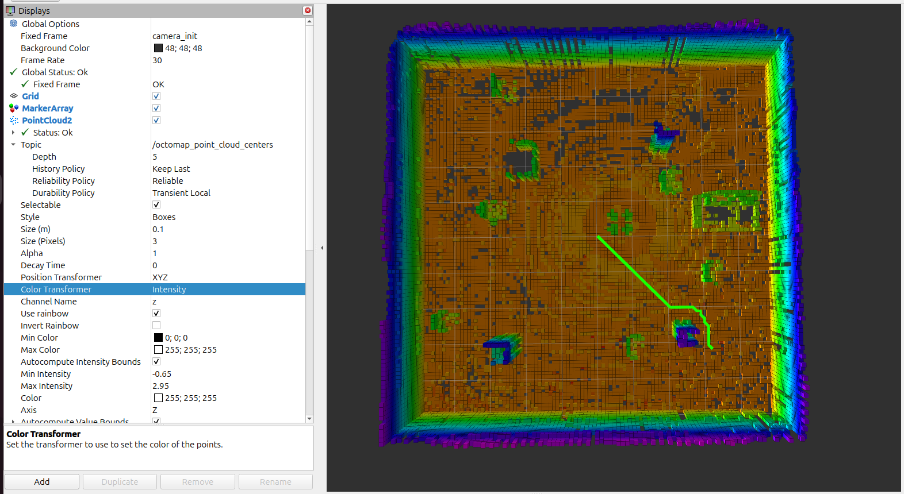
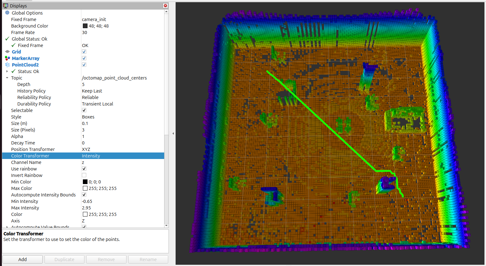
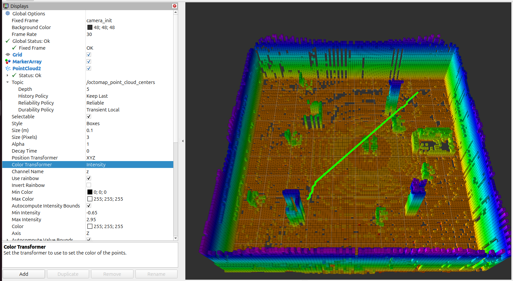
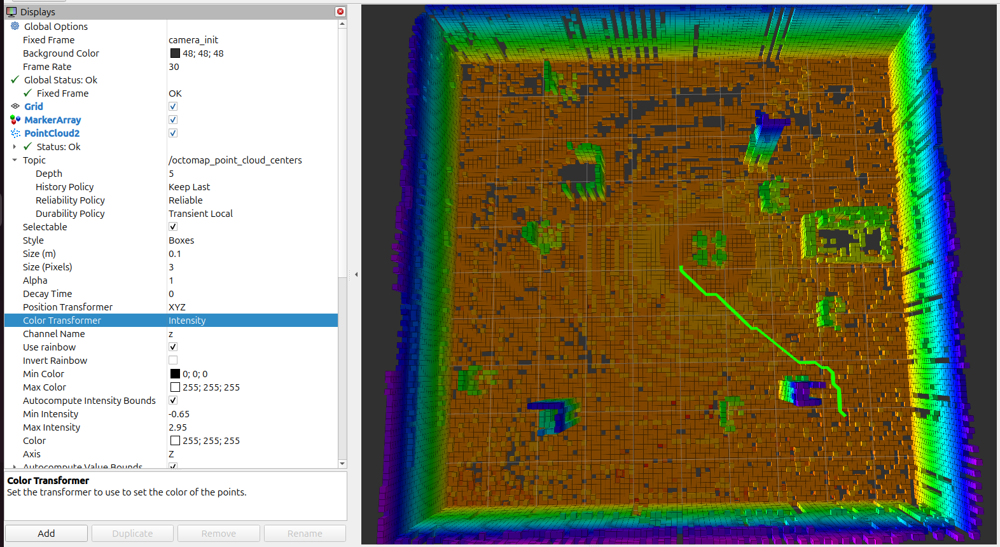

# M9 — 3D A* Path Planning

**Status:** Complete 
**Platform:** ROS 2 Jazzy, OctoMap, RViz 
**Planner:** Custom C++ 3D A* implementation

## 1. Objective

The objective of M9 was to implement and validate three-dimensional path planning using the occupancy map generated during M8.

Unlike planar path planning, the 3D planner considers changes in altitude and applies horizontal and vertical obstacle-clearance constraints.

M9 uses a previously saved OctoMap. It performs offline planning rather than updating its route continuously during flight.

## 2. System Architecture

    Saved M8 OctoMap (.bt)
              |
              v
      OctoMap OcTree
              |
              v
       Custom 3D A*
              |
              v
    Occupancy and Clearance Checks
              |
              v
       Path Validation
              |
              v
         /planned_path
              |
              v
             RViz

The custom ROS 2 package is located at:

    ros2_ws/src/drone_3d_planner/

Its main components are:

- astar_3d.cpp: 3D A* path planner and path publisher.
- octomap_query.cpp: interactive OctoMap occupancy-query utility.
- CMakeLists.txt and package.xml: ROS 2 package configuration.

## 3. Planning Configuration

The validated baseline uses the following parameters:

| Parameter | Value |
|---|---:|
| Map resolution | 0.10 m |
| Horizontal clearance | 0.30 m |
| Vertical clearance | 0.20 m |
| Default start | (0.0, 0.0, 1.0) m |
| Default goal | (3.0, 3.0, 1.0) m |
| Reference frame | camera_init |
| Published path | /planned_path |

The planner loads the saved M8 OctoMap directly from disk.

The map is also loaded into octomap_server separately to provide RViz visualization.

## 4. Build Instructions

From the repository root:

    source /opt/ros/jazzy/setup.bash

    cd ros2_ws

    colcon build --packages-select drone_3d_planner

    source install/setup.bash

    cd ..

The required ROS 2 and OctoMap development dependencies must already be installed.

## 5. Offline Visualization and Planning

The following terminals reproduce the validated M9 workflow.

### Terminal 1 — Static Transform

This transform is used for offline RViz visualization.

    source /opt/ros/jazzy/setup.bash
    source ~/drone_ws/install/setup.bash

    ros2 run tf2_ros static_transform_publisher \
      --x 0 --y 0 --z 0 \
      --roll 0 --pitch 0 --yaw 0 \
      --frame-id world \
      --child-frame-id camera_init

### Terminal 2 — Load the Saved OctoMap

From the repository root:

    source /opt/ros/jazzy/setup.bash
    source ~/drone_ws/install/setup.bash

    ros2 run octomap_server octomap_server_node \
      --ros-args \
      -p use_sim_time:=false \
      -p frame_id:=camera_init \
      -p octomap_path:="$PWD/octomap/maps/slam_room_office_m8.bt" \
      -p full:=true \
      -p resolution:=0.10 \
      -p latch:=true \
      -r cloud_in:=/m9_no_live_cloud

The cloud remapping prevents incoming sensor data from modifying the saved map.

### Terminal 3 — RViz

    source /opt/ros/jazzy/setup.bash
    source ~/drone_ws/install/setup.bash

    rviz2

RViz configuration:

- Fixed Frame: camera_init
- PointCloud2 topic: /octomap_point_cloud_centers
- PointCloud2 Style: Boxes
- PointCloud2 Size: 0.10 m
- Reliability: Reliable
- Durability: Transient Local
- Color Transformer: AxisColor
- Axis: Z
For the planned path:

- Display: Path
- Topic: /planned_path
- Reliability: Reliable
- Durability: Transient Local
- History: Keep Last
- Depth: 1
- Line Style: Billboards
- Line Width: 0.08

Transient Local durability is important because the saved map may publish its visualization immediately after loading.

### Terminal 4 — Execute the 3D Planner

After building and sourcing the repository's ROS 2 workspace, return to the repository root:

    ros2 run drone_3d_planner astar_3d --ros-args \
      -p map_path:="$PWD/octomap/maps/slam_room_office_m8.bt"

The planner reads the saved map directly and publishes the resulting path.

## 6. Test 1 — Standard Path Planning

Start:

    (0.0, 0.0, 1.0)

Goal:

    (3.0, 3.0, 1.0)

Recorded results:
| Measurement | Result |
|---|---:|
| Planning | A* SUCCESS |
| Expanded nodes | 9,250 |
| Path nodes | 38 |
| Path distance | 4.65 m |
| Path altitude | 1.05 m |
| Final path validation | PASS |

This test demonstrated successful planning between two positions at the same requested altitude.

### Visualization

## 7. Test 2 — Full 3D Path Planning

An additional test used different start and goal altitudes.

Start:

    (0.0, 0.0, 0.8)

Goal:

    (3.0, 3.0, 1.6)

Command:

    ros2 run drone_3d_planner astar_3d --ros-args \
      -p map_path:="$PWD/octomap/maps/slam_room_office_m8.bt" \
      -p start_x:=0.0 \
      -p start_y:=0.0 \
      -p start_z:=0.8 \
      -p goal_x:=3.0 \
      -p goal_y:=3.0 \
      -p goal_z:=1.6
Recorded results:

| Measurement | Result |
|---|---:|
| Planning | A* SUCCESS |
| Path distance | 4.91 m |
| Path altitude range | 0.85–1.65 m |
| Final path validation | PASS |

The test demonstrated planning with a change in altitude while maintaining the configured clearance requirements.

## 8. Additional Planning Visualizations

The following screenshots show additional RViz views and planning runs.

## 9. Results and Limitations

M9 successfully implemented custom 3D A* path planning using the saved M8 OctoMap.

Both the standard path and the altitude-changing test returned successful planning and passed final path validation.

The planner currently operates on a frozen occupancy map. The demonstrated results establish offline path planning but do not establish real-time obstacle avoidance, online replanning, or autonomous execution of the planned routes.

These capabilities will be addressed in subsequent milestones.
