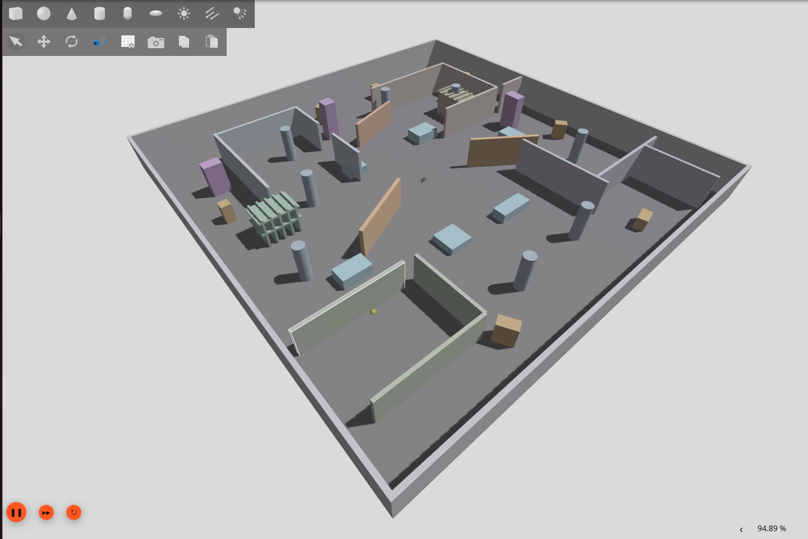

# M10 — Localization Robustness and Ground-Truth Testing

**Status:** In progress — initial localization testing completed 
**Platform:** ROS 2 Jazzy, PX4 SITL, Gazebo Harmonic 
**Localization:** Point-LIO 
**Environment:** Custom geometrically rich 3D simulation world

## 1. Objective

M10 extends the previous mapping and planning milestones toward
autonomous navigation and obstacle avoidance.

The first stage focuses on validating Point-LIO localization in a
larger, geometrically rich Gazebo environment.

The objective is to improve localization robustness during flight,
particularly at higher altitudes, and compare the estimated drone
position against Gazebo ground truth.

This stage evaluates the localization system before integrating
real-time path execution and obstacle avoidance.

## 2. Background

Earlier Point-LIO experiments revealed localization difficulties
when the drone operated at greater heights in environments with
limited useful three-dimensional geometric features.

To investigate this limitation, a new Gazebo environment was
developed with more varied structures and obstacles.

Additional LiDAR preprocessing diagnostics were also conducted
to investigate invalid simulated sensor measurements.
## 3. New Gazebo Environment

The new simulation environment contains varied geometric
structures, including:

- Tall cylindrical and rectangular pillars.
- Partial walls and partitions.
- Structures with different orientations.
- Obstacles of varying heights.
- Shelves and additional elevated geometry.
- Asymmetric obstacle arrangements.

These features provide a more varied set of geometric surfaces
for evaluating LiDAR-inertial localization.

The environment is stored at:

    gazebo/worlds/m10_large_world.sdf

### Environment — View 1

### Environment — View 2

## 4. Localization System

The testing system uses the following pipeline:

    Gazebo Harmonic
           |
           v
    Simulated 3D LiDAR
           +
    Simulated IMU
           |
           v
    Gazebo-to-ROS Bridge
           |
           v
    LiDAR Time Converter
           |
           v
       Point-LIO
           |
           v
    Estimated Drone Pose
           |
           v
    Ground-Truth Comparison
Point-LIO produces the estimated pose on:

    /aft_mapped_to_init

Gazebo provides the reference simulation pose.

A valid quantitative comparison requires consistent coordinate
frames, initial-pose alignment, and synchronized measurements.

## 5. Simulation Launch

Start PX4 SITL with the custom drone and M10 environment:

    cd ~/PX4-Autopilot

    PX4_GZ_WORLD=m10_large_world make px4_sitl gz_slam_quad

The simulation uses the custom slam_quad model.

The validated testing setup uses ROS 2 Jazzy and Gazebo Harmonic.

Relevant ROS components include:

- Micro XRCE-DDS Agent for ROS-to-PX4 communication.
- Consolidated Gazebo-to-ROS sensor bridge.
- slam_quad_description for sensor transforms.
- LiDAR time converter.
- Point-LIO localization.

The exact operational launch sequence depends on whether the
session is performing mapping, localization testing, or flight
control.

## 6. Point-LIO Configuration

The M10 configuration is preserved separately at:

    point_lio/config/velody16_m10.yaml
Relevant settings include:

| Parameter | Value |
|---|---|
| LiDAR topic | /slam_quad/lidar/points_timed |
| IMU topic | /slam_quad/imu |
| LiDAR type | Velodyne-compatible |
| Scan lines | 32 |
| Timestamp unit | Seconds |
| Minimum LiDAR range | 0.20 m |
| Body-frame scan publication | Enabled |
| IMU integration interval | 0.004 s |

The repository preserves the earlier Point-LIO configuration
separately to avoid overwriting the previous milestone's baseline.

## 7. LiDAR Preprocessing Investigation

Additional experiments revealed that Gazebo can produce
non-finite LiDAR measurements for rays without valid returns.

One earlier office-environment diagnostic recorded:

    Total points: 20,480
    Finite points: 20,480

A separate asymmetric-environment diagnostic recorded:

    Total points: 20,480
    Finite points: 16,197
    Non-finite points: 4,283

These results belong to separate diagnostic environments and
should not be interpreted as the measured localization accuracy
of the final M10 large-world experiment.
### Preprocessing Modification

A targeted modification was introduced into the Point-LIO
Velodyne preprocessing function.

The modification rejects points with non-finite X, Y, or Z
coordinates before passing them to the estimator.

The change is preserved as a standalone patch:

    point_lio/patches/m10_filter_nonfinite_lidar.patch

The patch allows the modification to be reviewed separately
without incorporating an entire modified copy of Point-LIO
into this repository.

## 8. Large-World Localization Testing

The larger environment was used to evaluate Point-LIO tracking
against Gazebo's simulated ground-truth pose.

Testing included flight at approximately 1.8 m altitude.

The initial experiments indicated improved tracking behavior
in the geometrically richer environment compared with earlier
tests that experienced localization difficulties at height.
This is an observed experimental result rather than a
quantitative accuracy guarantee.

The final numerical error measurements should be documented
alongside their associated test configuration and trajectory.

## 9. Ground-Truth Verification

Point-LIO estimated position can be inspected using:

    ros2 topic echo /aft_mapped_to_init --once \
      --field pose.pose.position

Gazebo model pose can be inspected using:

    gz model -m slam_quad_0 --pose

Before calculating tracking error, the two poses must be
expressed in equivalent coordinate frames.

The comparison should account for differences between
Gazebo's world frame and Point-LIO's camera_init frame,
including the initial pose and any rotational offset.

Useful evaluation measurements include:

- Position error along X, Y, and Z.
- Three-dimensional position error.
- Tracking behavior during translation.
- Localization stability at different altitudes.
- Recovery following direction changes.

## 10. Results and Current Status

The first stage of M10 established:

- A larger, geometrically rich Gazebo testing environment.
- A separate Point-LIO configuration for M10 experiments.
- An investigation of non-finite simulated LiDAR measurements.
- A targeted preprocessing correction preserved as a patch.
- Localization testing at approximately 1.8 m altitude.
- Comparison of Point-LIO estimates with Gazebo ground truth.

Exact numerical tracking-error results will be added from
the recorded successful experiment.

Real-time path execution, online replanning, and integrated
obstacle avoidance have not yet been demonstrated by this
stage of M10.

## 11. Next Development Stage

The next stage will integrate localization, occupancy mapping,
and three-dimensional planning into an autonomous navigation
pipeline.

Testing will then focus on validating safe path execution
and obstacle avoidance in the simulated environment.
